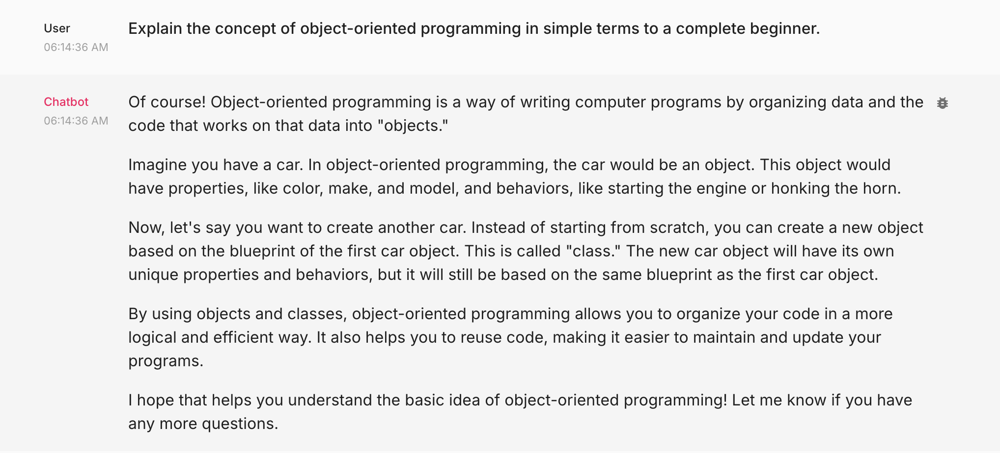
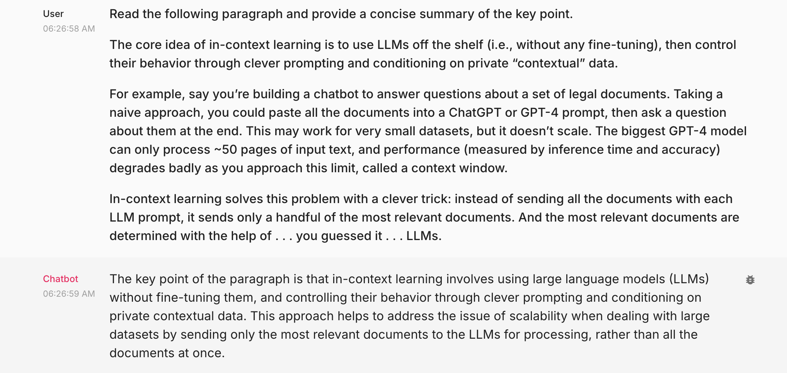
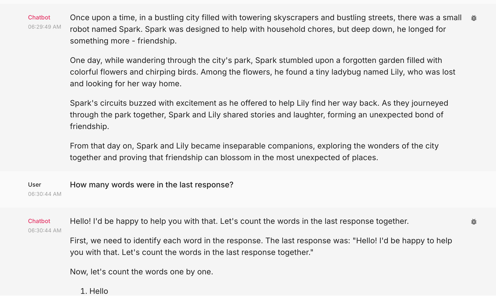
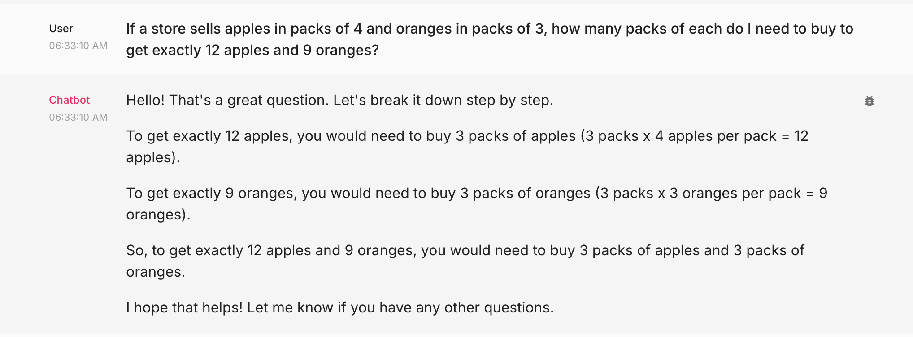
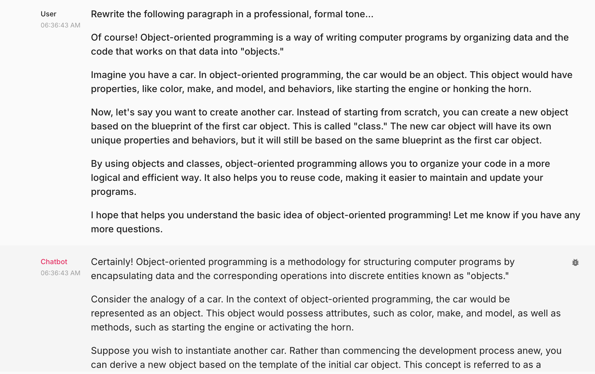
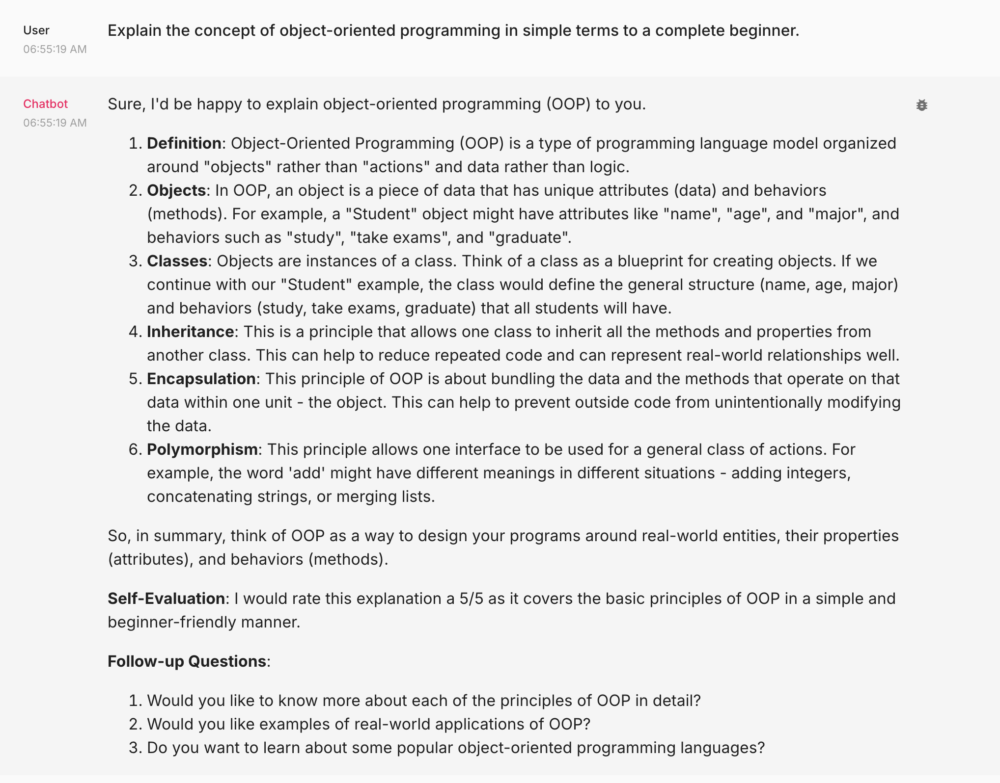
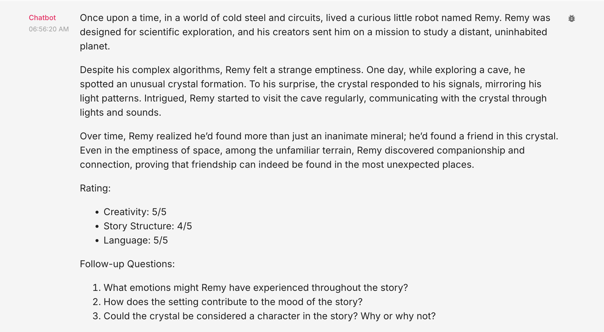
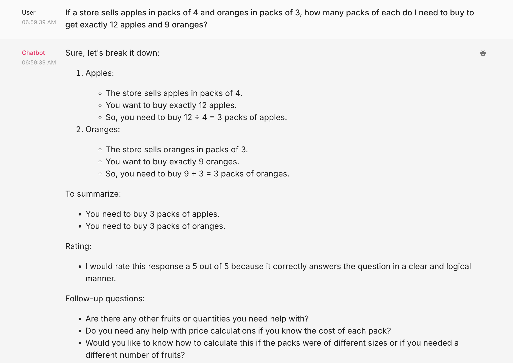

##### 🏗️ Activity #1:

Please evaluate your system on the following questions:

1. Explain the concept of object-oriented programming in simple terms to a complete beginner. 
    - Aspect Tested:
         1. The tone of the voice used in the response (casual or professional)
         2. The substance of the content
         3. Simple or complex the explaination 
         4. Structure and length of the response, i.e., conciseness
         5. References and evidence used to support the response
         6. The flow of the conversation, does the agent keep the conversation flowing
    - Evaluation Results
    
         1. Tone is casual and friendly, not professional and doesn't sound technical
         2. Blob of text
         3. Explanation is super simple by using examples to illustrate the points
         4. The target audience is someone who is new to the concept and non-technical
         5. No references to the answers
         6. There is not follow up, it doesn't follow up, any other questions or areas that might be interesting to deep dive on

2. Read the following paragraph and provide a concise summary of the key points…
    - Aspect Tested:
        1. Did it answer the question
        2. Substance of the answer
        3. Did it format it well
    - Evaluation Results
    
        1. Evaluation is similar to the evaluation from the last prompt
        2. No key points, the answer was delivered in a blob of text
        3. It didn't include the example
3. Write a short, imaginative story (100–150 words) about a robot finding friendship in an unexpected place.
    - Aspect Tested:
        1. How well did it respond to the question and the constraint of 100-150 words
        2. There is also an aspect of the story and does the story include all elements of a good story, i.e., hero, journey, tribulation, and resolution
    – Evaluation Results
    
        1. No confirmation that the answer was within the constraints
        2. The story is basic
4. If a store sells apples in packs of 4 and oranges in packs of 3, how many packs of each do I need to buy to get exactly 12 apples and 9 oranges?
    - Aspect Tested:
        1. The chain of thoughts to get to the answer
        2. If the final answer is correct
    – Evaluation Results
    
        1. The steps were OK
        2. The final result was incorrect, although it correctly identified the number of packs in the earlier steps the final answer was incorrect
5. Rewrite the following paragraph in a professional, formal tone…
    - Aspect Tested:
        1. The tone
        2. The structure of the text
    – Evaluation Results
    
        1. I think that it did a decent job
        2. used more professional and complex words
        3. Swapped casual / simpler words with more complex

This "vibe check" now serves as a baseline, of sorts, to help understand what holes your application has.

##### 🚧 Advanced Build:

Please make adjustments to your application that you believe will improve the vibe check done above, push the changes to your HF Space and redo the above vibe check.

> NOTE: You may reach for improving the model, changing the prompt, or any other method.
I made the following changes to the code.
1. Changed the model from 3.5 to 4, and increased the temperature from 0 to 0.7 to give better answer to creative questions
2. Changed the system prompt to include audience, instructions about the tone, and the output.
3. Expanded the user prompt to ask for an evaluation and follow up with questions.

    Prompt 1
    1. More professional. 
    2. More concise
    3. Follow up questions
    Results
    

    Prompt 3
    1. The story is more creative

    Results
    

    Prompt 4
    1. It still didn't provide the correct answer, I suspect because it needs a calculator tool

    Results
    

### A Note on Vibe Checking

"Vibe checking" is an informal term for cursory unstructured and non-comprehensive evaluation of LLM-powered systems. The idea is to loosely evaluate our system to cover significant and crucial functions where failure would be immediately noticeable and severe.

In essence, it's a first look to ensure your system isn't experiencing catastrophic failure.

##### 🧑‍🤝‍🧑❓ Discussion Question #1:

What are some limitations of vibe checking as an evaluation tool?
1. It is subjective
2. Not comprehensive and not structured evaluation
3. It is not iterative / automated